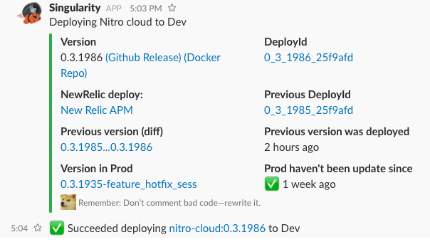
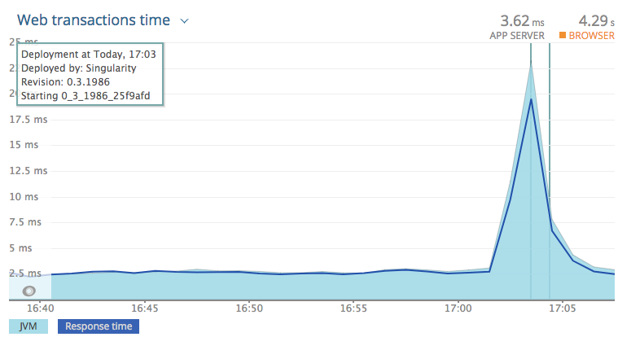

# Singularity web-hook broadcast

Process Singularity events and sends a custom messages to Slack and a Deploy Report to NewRelic







Warning, this project is in very early stage, it was developed as a internal HackWeek at Nitro
and it still needs some customization/changes to be used as a generic notification tool outside Nitro.

# Run it locally

Edit `src/main/resources/application.conf` and run `sbt run`

```
curl -i -H "Content-Type: application/json" \
 -X POST http://localhost:8080/singularity/webhook/deploy \
 -d@docs/1_deploy_starting.json
```

# Release

```
sbt docker:publish
nmesos release singularity-broadcast -e dev -t 0.0.6-SNAPSHOT --dryrun false
nmesos release singularity-broadcast -e prod -t 0.0.6-SNAPSHOT --dryrun false
```

# Register the WebHook

You must register the webhook at
`http://<<Singularity Url>>/singularity/webhooks`


# Stack

Project implemented using `scala`, `cats` and `scala-effect`.

